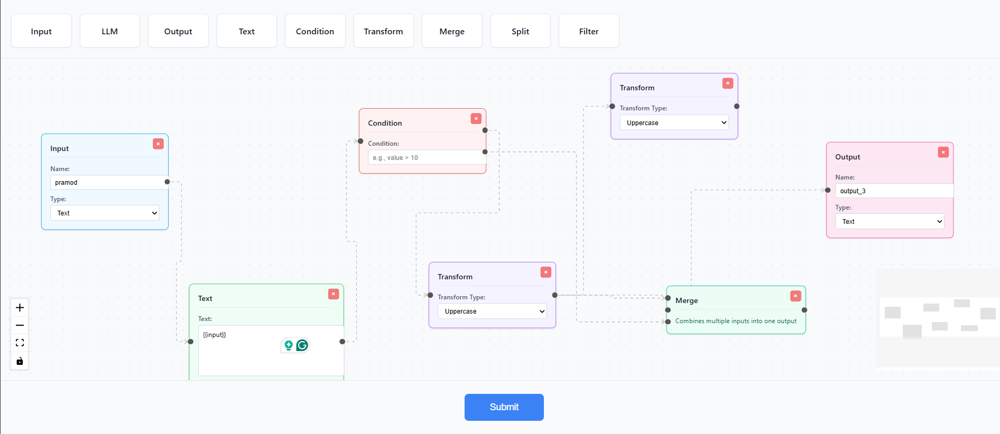

# VectorShift Pipeline Builder
## Output Preview


A visual pipeline builder application that allows you to create, connect, and analyze node-based workflows.

## Features

- **Visual Node Editor**: Drag and drop nodes to create pipelines
- **Multiple Node Types**: 9 different node types for various operations
- **Dynamic Text Variables**: Create dynamic text nodes with variable inputs
- **Pipeline Analysis**: Submit pipelines to analyze structure and detect cycles
- **Modern UI**: Clean, professional interface with consistent styling

## Getting Started

### Prerequisites

- **Node.js** (v14 or higher) - for frontend
- **Python 3.8+** - for backend
- **npm** or **yarn** - for package management
- **pip** - for Python packages

### Installation

1. **Install Frontend Dependencies**
   ```bash
   cd frontend
   npm install
   ```

2. **Install Backend Dependencies**
   ```bash
   cd backend
   pip install -r requirements.txt
   ```

### Running the Application

You need to run both the frontend and backend servers:

**Terminal 1 - Backend Server:**
```bash
cd backend
uvicorn main:app --reload --port 8000
```

The backend will be available at `http://localhost:8000`

**Terminal 2 - Frontend Server:**
```bash
cd frontend
npm start
```

The frontend will automatically open at `http://localhost:3000`

## How to Use

### 1. Creating Nodes

- **Drag nodes from the toolbar** at the top of the screen
- Drop them anywhere on the canvas
- Each node type has a different color and purpose

### 2. Available Node Types

#### **Input Node** (Blue)
- Purpose: Entry point for data into your pipeline
- Configuration:
  - **Name**: Custom name for the input
  - **Type**: Text or File
- Output: One output handle on the right

#### **Output Node** (Pink)
- Purpose: Final destination for pipeline results
- Configuration:
  - **Name**: Custom name for the output
  - **Type**: Text or Image
- Input: One input handle on the left

#### **LLM Node** (Yellow)
- Purpose: Large Language Model processing
- Inputs: 
  - System prompt (top handle)
  - User prompt (bottom handle)
- Output: One output handle on the right

#### **Text Node** (Green)
- Purpose: Text processing with dynamic variables
- Features:
  - **Auto-resizing**: Node height adjusts automatically as you type
  - **Variable Detection**: Use `{{variableName}}` to create input handles
  - **Valid Identifiers**: Variable names must be valid JavaScript identifiers (letters, numbers, underscore, dollar sign)
- Example: Type `Hello {{name}}, your score is {{score}}` to create two input handles
- Output: One output handle on the right

#### **Condition Node** (Red)
- Purpose: Conditional branching based on criteria
- Configuration:
  - **Condition**: Enter your condition (e.g., `value > 10`)
- Input: One input handle
- Outputs: Two outputs (true/false paths)

#### **Transform Node** (Purple)
- Purpose: Transform text data
- Configuration:
  - **Transform Type**: 
    - Uppercase
    - Lowercase
    - Trim
    - Reverse
- Input: One input handle
- Output: One output handle

#### **Merge Node** (Teal)
- Purpose: Combine multiple inputs into one output
- Inputs: Three input handles
- Output: One output handle

#### **Split Node** (Orange)
- Purpose: Split input using a delimiter
- Configuration:
  - **Delimiter**: Character(s) to split on (default: comma)
- Input: One input handle
- Outputs: Two output handles

#### **Filter Node** (Blue)
- Purpose: Filter data based on criteria
- Configuration:
  - **Filter Criteria**: Enter your filter condition (e.g., `length > 5`)
- Input: One input handle
- Output: One output handle

### 3. Connecting Nodes

1. **Hover over a node's output handle** (right side)
2. **Click and drag** to an input handle (left side) of another node
3. **Release** to create a connection
4. Connections are animated and show data flow direction

### 4. Text Node Variables

The Text node has special variable functionality:

1. **Type text** in the textarea
2. **Use double curly brackets** to define variables: `{{variableName}}`
3. **Valid variable names**:
   - Must start with letter, underscore, or dollar sign
   - Can contain letters, numbers, underscores, dollar signs
   - Examples: `{{input}}`, `{{userName}}`, `{{score_1}}`
4. **Input handles appear automatically** on the left side for each unique variable
5. **Handles update dynamically** as you add/remove variables

**Example:**
```
Input text: "Hello {{name}}, you have {{count}} messages"
Result: Two input handles created for "name" and "count"
```

### 5. Moving and Organizing Nodes

- **Click and drag** nodes to reposition them
- Nodes snap to a grid for alignment
- Use the **MiniMap** (bottom right) to navigate large pipelines
- Use **Controls** (bottom left) to zoom in/out and fit to screen

### 6. Deleting Nodes

You can delete nodes in three ways:

1. **Delete Button**: Click the red **×** button in the top-right corner of any node
2. **Keyboard**: Select a node (click on it) and press **Delete** or **Backspace** key
3. **Automatic Cleanup**: When you delete a node, all connected edges are automatically removed

### 7. Submitting and Analyzing Pipelines

1. **Create your pipeline** by adding and connecting nodes
2. **Click the "Submit" button** at the bottom of the screen
3. **Wait for processing** (button shows "Submitting...")
4. **Alert will display** with analysis results:
   - **Number of Nodes**: Total nodes in your pipeline
   - **Number of Edges**: Total connections between nodes
   - **Is DAG**: Whether your pipeline is a Directed Acyclic Graph (no cycles)

### 8. Understanding DAG (Directed Acyclic Graph)

A **DAG** means:
- ✅ **No cycles**: Data flows in one direction without loops
- ✅ **Valid pipeline**: Can be executed in a defined order
- ❌ **Not a DAG**: Contains cycles, which can cause infinite loops

**Example of a cycle (Not DAG):**
```
Node A → Node B → Node C → Node A (cycle!)
```

**Example of a DAG:**
```
Input → Transform → Condition → Output
                ↓
              Merge
```

## Tips and Best Practices

1. **Start with Input nodes** - These are your data sources
2. **End with Output nodes** - These are your final destinations
3. **Use Text nodes for templating** - Great for dynamic content with variables
4. **Check for cycles** - Submit your pipeline to verify it's a valid DAG
5. **Name your nodes clearly** - Use descriptive names for inputs/outputs
6. **Organize visually** - Arrange nodes logically from left to right

## Troubleshooting

### Frontend won't start
- Check if port 3000 is already in use
- Ensure all dependencies are installed: `npm install`

### Backend won't start
- Check if port 8000 is already in use
- Verify Python and pip are installed
- Install dependencies: `pip install -r requirements.txt`

### Submit button shows error
- Ensure backend is running on `http://localhost:8000`
- Check browser console for detailed error messages
- Verify nodes and edges are properly connected

### Text node variables not appearing
- Ensure variable names are valid JavaScript identifiers
- Check that variables are wrapped in double curly brackets: `{{variableName}}`
- Variables are case-sensitive

## API Endpoints

### POST `/pipelines/parse`
Analyzes a pipeline and returns statistics.

**Request Body:**
```json
{
  "nodes": [...],
  "edges": [...]
}
```

**Response:**
```json
{
  "num_nodes": 5,
  "num_edges": 4,
  "is_dag": true
}
```

## Project Structure

```
vector-shift/
├── frontend/
│   ├── src/
│   │   ├── nodes/          # Node components
│   │   │   ├── BaseNode.js      # Reusable node abstraction
│   │   │   ├── inputNode.js
│   │   │   ├── outputNode.js
│   │   │   ├── llmNode.js
│   │   │   ├── textNode.js      # With variable detection
│   │   │   └── ... (5 new nodes)
│   │   ├── submit.js        # Backend integration
│   │   ├── store.js         # State management
│   │   └── ui.js            # Main ReactFlow UI
│   └── package.json
├── backend/
│   ├── main.py             # FastAPI server with DAG detection
│   └── requirements.txt
└── README.md
```

## Technologies Used

- **Frontend**: React, ReactFlow, Zustand
- **Backend**: Python, FastAPI, Pydantic
- **Styling**: Inline styles with modern design system

---

Enjoy building your pipelines! 🚀
